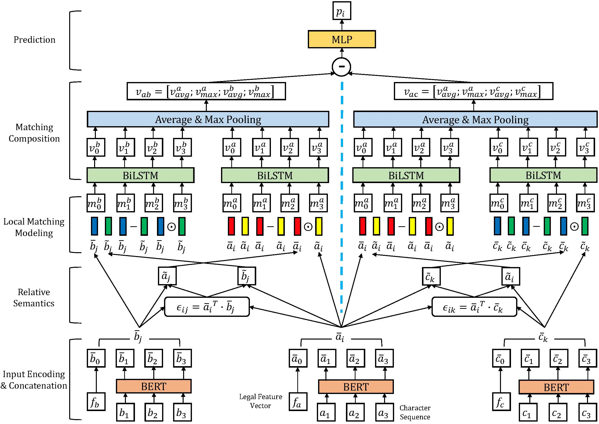

# Legal Feature Enhanced Semantic Matching Network for Similar Case Matching

## Description

This repository is the source code of the paper *Legal Feature Enhanced Semantic Matching Network for Similar Case Matching* implemented via PyTorch.

## Model Overview

<div align="center">
    
    <span>Fig. 1 Overview of LFESM</span>
</div>

## Install and Run

### Install

* Python 3.6+
* PyTorch 1.1.0+
* Nvidia Apex (optional): Nvidia Apex enables mixed-precision training to accelerate the training procedure and decrease the memory usage. See [official doc](https://github.com/NVIDIA/apex) for installation. Specify `fp16 = False` in train.py to disable it.

```bash
pip -r requirements.txt
```

* Hardware: we recommend to use GPU to train LFESM. In our experiment, when we train the model with batch_size=3, fp16=True on 2\* GeForce RTX 2080, it takes 1~1.5 hour to finish one epoch.
* Dataset: see [Dataset](#dataset).
* BERT pretrained model: download the pretrained model [here](https://thunlp.s3.cn-north-1.amazonaws.com.cn/plm/ms.zip), and unzip the model into `./bert` folder. See [OpenCLaP](https://github.com/thunlp/OpenCLaP) for details.

### Train

```bash
python train.py
```

Our default parameters:

```python
config = {
    "max_length": 512,
    "epochs": 6,
    "batch_size": 3,
    "learning_rate": 2e-5,
    "fp16": True,
    "fp16_opt_level": "O1",
    "max_grad_norm": 1.0,
    "warmup_steps": 0.1,
}
```

### Predict

```bash
python predict.py
```

The output of the prediction is stored in `./data/test/output.txt`.

Run `./scripts/judger.py` to calculate the accuracy score.

## Dataset

Download the dataset CAIL2019-SCM from [here](https://cail.oss-cn-qingdao.aliyuncs.com/cail2019/CAIL2019-SCM.zip). You can refer to [CAIL2019](https://github.com/china-ai-law-challenge/CAIL2019/tree/master/scm) for more details about the dataset.

Table 1 The amount of data in CAIL2019-SCM

| Dataset | sim(a, b)>sim(a,c)​ | sim(a,b)<sim(a,c)​ | Total Amount |
| ------- | ------------------ | ----------------- | ------------ |
| Train   | 2,596              | 2,506             | 5,102        |
| Valid   | 837                | 663               | 1,500        |
| Test    | 803                | 733               | 1,536        |

Unzip the dataset and put the train, valid, and test set into `raw`, `valid`, and `test` folder in `./data` folder.

### Data Augmentation

To fulfill the distribution of dataset and enhance the performance of model training, we apply data augmentation to augment the data. 

Let's denote the original triplet as `(A, B, C)`. We add `(A, C, B)` into the dataset, which makes the amount multiply twice. We also tried other methods like `(B, C, A)` and `(B, A, C)`, but they do not work.

## Project Files

```bash
lfesm
├── bert                   # BERT pretrained model
├── config.py              # Model config and hyper parameter
├── data                   # Store the dataset
├── data.py                # Define the dataset
│   └── ...
├── model.py               # Define the model trainer
├── models                 # Define the models
│   ├── baseline
│   ├── esim
│   ├── feature.py
│   ├── lfesm.py
├── predict.py             # Predict
├── scripts                # Utilities
│   └── ...
├── train.py               # Train
└── util.py                # Utility function
```

## Results

Table 2 Experimental results of methods on CAIL2019-SCM

|              | Method     | Valid     | Test      |
| ------------ | ---------- | --------- | --------- |
| Baseline     | BERT       | 61.93     | 67.32     |
|              | LSTM       | 62.00     | 68.00     |
|              | CNN        | 62.27     | 69.53     |
| Our Baseline | BERT       | 64.53     | 65.59     |
|              | LSTM       | 64.33     | 66.34     |
|              | CNN        | 64.73     | 67.25     |
| Best Score   | 11.2yuan   | 66.73     | 72.07     |
|              | backward   | 67.73     | 71.81     |
|              | AlphaCourt | 70.07     | 74.15     |
| Our Method   | LFESM      | **70.01** | **74.15** |

## Reference

[1] [coetaur0/ESIM](https://github.com/coetaur0/ESIM)

[2] [padeoe/cail2019](https://github.com/padeoe/cail2019)

[3] [thunlp/OpenCLaP](https://github.com/thunlp/OpenCLaP)

[4] [CAIL2019-SCM](https://github.com/china-ai-law-challenge/CAIL2019/tree/master/scm)

[5] [Taoooo9/Cail_Text_similarity_esimtribert](https://github.com/Taoooo9/Cail_Text_similarity_esimtribert)

#### Acknowledgement

We sincerely appreciate [Taoooo9](https://github.com/Taoooo9)‘s help.

---

Author: [Zhilong Hong](https://github.com/Thesharing), [Qifei Zhou](https://github.com/Mrzhouqifei), [Rong Zhang](https://github.com/rzhangpku), Tong Mo, and Weiping Li.